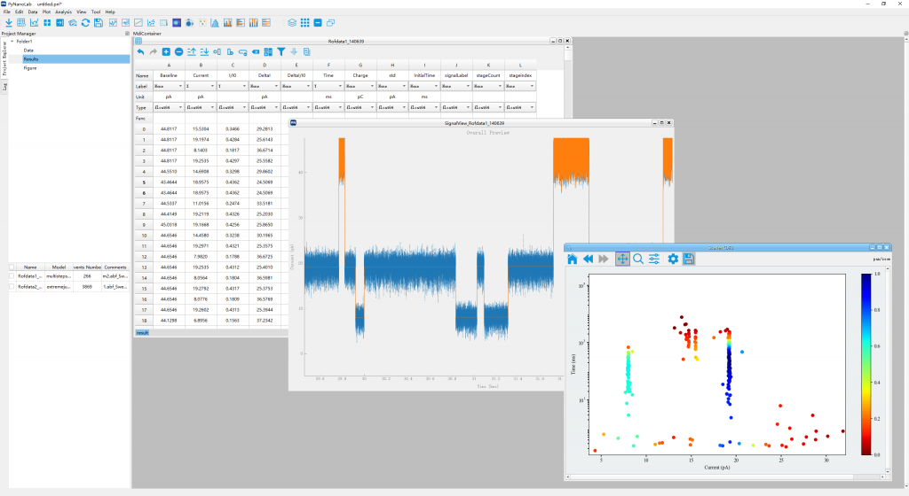
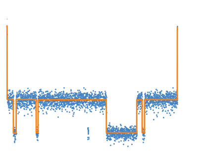
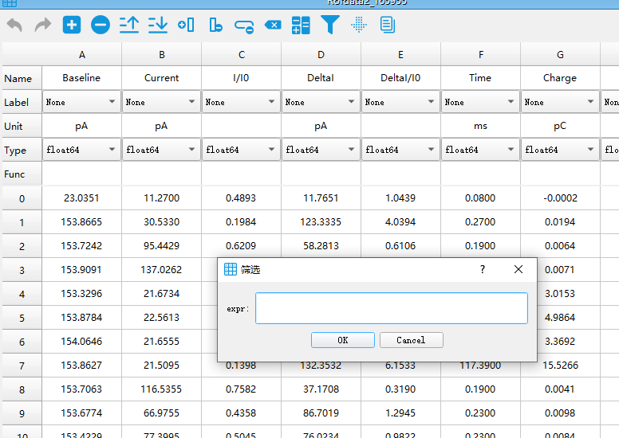
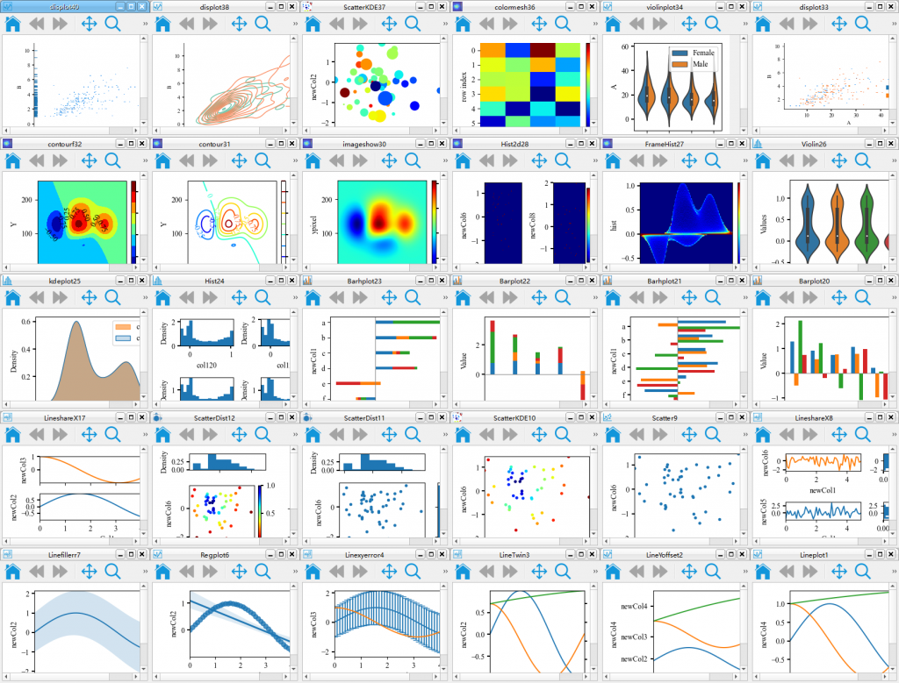
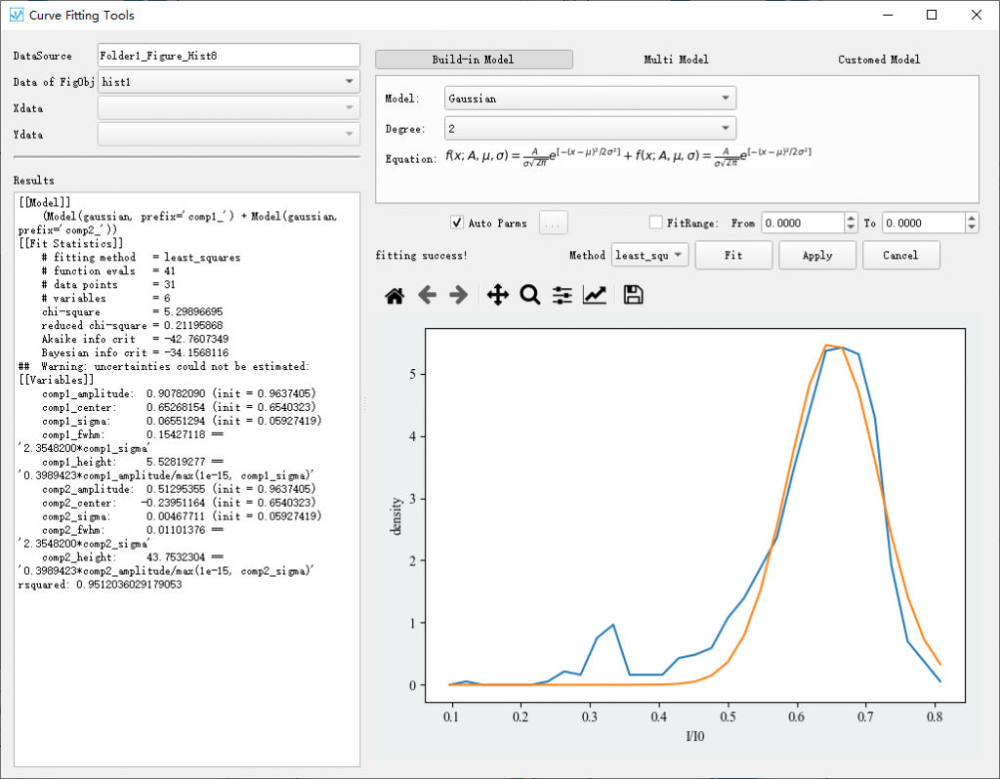
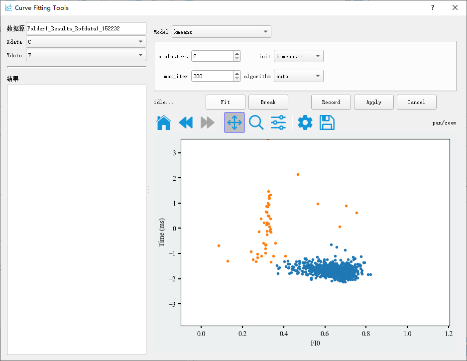
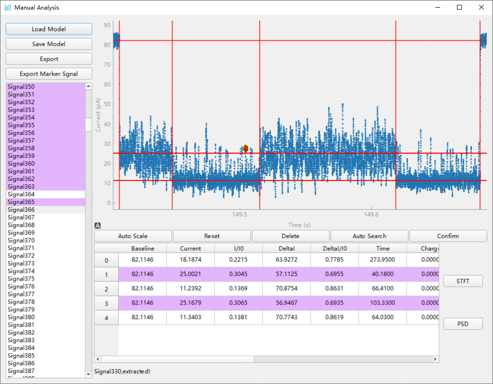

## PyNanoLab is an all in one GUI software for data analysis and visualization. It is also a free alternatives software for OrignaLab，
### Installition
Briefly， you could download the binary installer we have already builded for your operation system from [Here](https://sourceforge.net/projects/pynano/files/).
#### Source install tutorial
tips: this is only recommended Linux and Mac OS. In windows, you could download the .exe installation package we provided.  
##### 1. Download the source file for you operation system. and unzip it to a folder.  You folder tree looks like:   
  ---|   
      --- pynanolab   
      --- main.py   
      --- requirements.txt   
      --- run.sh  
 Then entrance this folder, the main.py is the entrance file of PyNanoLab.  
##### 2. build the pynanolab runtime environment
    use following command in terminal:         
``` sh  
    conda create -n pnl python=3.10.8   
    source activate # only needed in windows system when you use the git-bash for windows.  
    conda activate pnl      
```   
Then, if you want use intel-mkl based numpy to speed up the PyNanoLab:  
`conda install numpy`   
And Then:     
`pip install -r requirements.txt`   
- tips: for some requirement,you should have compiler in your system to build the package.
- in windows: Visual Studio; Linux: GCC ; Mac OS X： Xcode.
##### 3. Run the PyNanoLab: 
 use following command in terminal in the same folder of main.py: 
 ```
 conda activate pnl
 python main.py
 ```
 or just double click the file 'run.sh'.
         
### More and download in [PyNanoLab Site](https://www.pynanolab.com/).

PyNanoLab contains a variety of tools to complete the data analysis, statistics, curve fitting, and basic machine learning application. Visualization in pynanolab is based on matplotlib. The setup tools is desinged to control and set-up all the details of the figure with a GUI.
## Signal Extraction
- Extract signal automaticall
- Multiple File management
- Raw data denoise and filter   

## Data Processing
- Data filter and calculate with pandas
- iPython integration
- Manage your data like the excel     

##  Visualization
- Visualize data with matplotlib
- Interactive setup Figure
- Rebuild data and fig from project file.   

##  Curves Fitting
- Curves fitting with lmfit
- Multiple build-in models
- Interactive fitting   

##  Clustering
- Clustering of with scikit-learn
- Interactive parameter setting
- Real-time visualization    

## Nanopore ToolBox
- Custom and Auto signal analysis
- Time-Frequency spectral analysis
- Signal batch processing  



